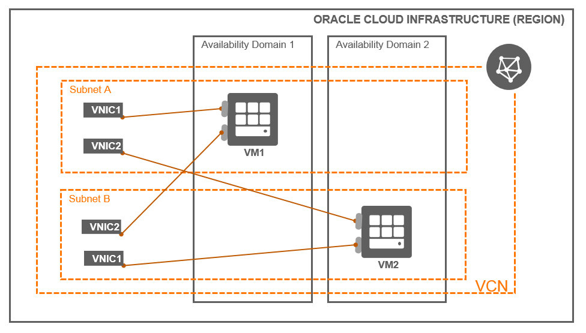

# OCI Compute Instance Module Example (Simple - Create and Attach a Block Volume and mount the volume using remote-exec)

## Introduction

| Complexity |
|---|
| Medium |

This example shows how to utilize the core-compute instance module in a very simplistic way, generating a VCN, 2 Subnets, 2 instances in each subnet and finally creating Secondary VNICs and attaching to them.. Here are all of the resources created in this example:

* 1x VCN
* 2x Subnets
* 2x Compute Instances
* 2x VNICs
* 2x Secondary VNICs

## Topology Diagram
This example is intended to the following OCI topology:



## Pre-Requisites
This example use other modules to deploy the required OCI Infrastructure. Update the module's `source` variable in `main.tf` file with the latest repository version.
* terraform-oci-tdf-network
* terraform-oci-tdf-subnet

## Using this example
Prepare one variable file named `terraform.tfvars` with the required information (or feel free to copy the contents from `terraform.tfvars.template`).  The contents of `terraform.tfvars` should look something like the following:

```
tenancy_ocid = "ocid1.tenancy.oc1..xxxxxxxxxxxxxxxxxxxxxxxxxxxxxxxxxxxxxxxxxxxxxxxxxxxxxxxxxxxx"
user_ocid = "ocid1.user.oc1..xxxxxxxxxxxxxxxxxxxxxxxxxxxxxxxxxxxxxxxxxxxxxxxxxxxxxxxxxxxx"
fingerprint= "xx:xx:xx:xx:xx:xx:xx:xx:xx:xx:xx:xx:xx:xx:xx:xx"
private_key_path = "~/.oci/oci_api_key.pem"
region = "us-phoenix-1"
default_compartment_ocid = "ocid1.compartment.oc1..xxxxxxxxxxxxxxxxxxxxxxxxxxxxxxxxxxxxxxxxxxxxxxxxxxxxxxxxxxxx"
```

Modify the content of `main.tf` accordingly your requirement.

Then apply the example using the following commands:

```
$ terraform init
$ terraform plan
$ terraform apply
```

## Checking the Result

Verify the instances created and the Secondary VNICs created and attached to the instances.


