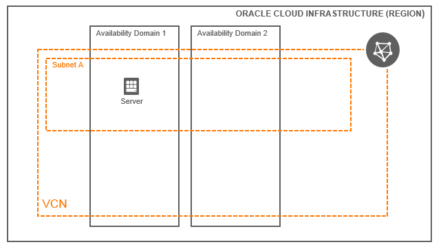

# OCI Instance Module Example (Simple)

## Introduction

| Complexity |
|---|
| Simple |

This example shows how to utilize the core-instance module in a very simplistic way, generating a Compute instance along with some accompanying resources.  Here are all of the resources created in this example:

* 1x Compute Instance
* 1x VNIC

## Topology Diagram
This example is intended to the following OCI topology:



## Pre-Requisites

* Subnet OCID - Update `main.tf` file and set the corresponding Subnet OCID on each Compute Instance
* Set of SSH Keys - Update `main.tf` file and set SSH Keys Path on each Compute Instance

## Using this example
Prepare one variable file named `terraform.tfvars` with the required information (or feel free to copy the contents from `terraform.tfvars.template`).  The contents of `terraform.tfvars` should look something like the following:

```
tenancy_ocid = "ocid1.tenancy.oc1..xxxxxxxxxxxxxxxxxxxxxxxxxxxxxxxxxxxxxxxxxxxxxxxxxxxxxxxxxxxx"
user_ocid = "ocid1.user.oc1..xxxxxxxxxxxxxxxxxxxxxxxxxxxxxxxxxxxxxxxxxxxxxxxxxxxxxxxxxxxx"
fingerprint= "xx:xx:xx:xx:xx:xx:xx:xx:xx:xx:xx:xx:xx:xx:xx:xx"
private_key_path = "~/.oci/oci_api_key.pem"
region = "us-phoenix-1"
default_compartment_ocid = "ocid1.compartment.oc1..xxxxxxxxxxxxxxxxxxxxxxxxxxxxxxxxxxxxxxxxxxxxxxxxxxxxxxxxxxxx"
```

Update the `main.tf` content with the values you need.

Then apply the example using the following commands:

```
$ terraform init
$ terraform plan
$ terraform apply
```
